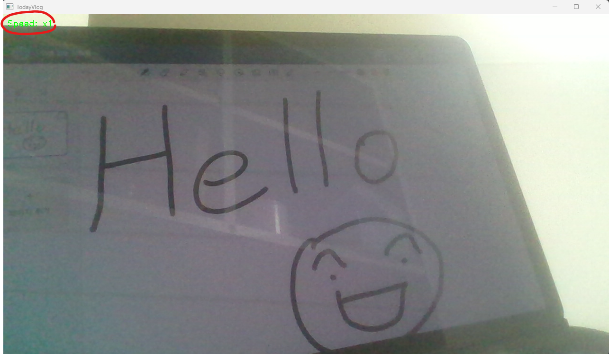
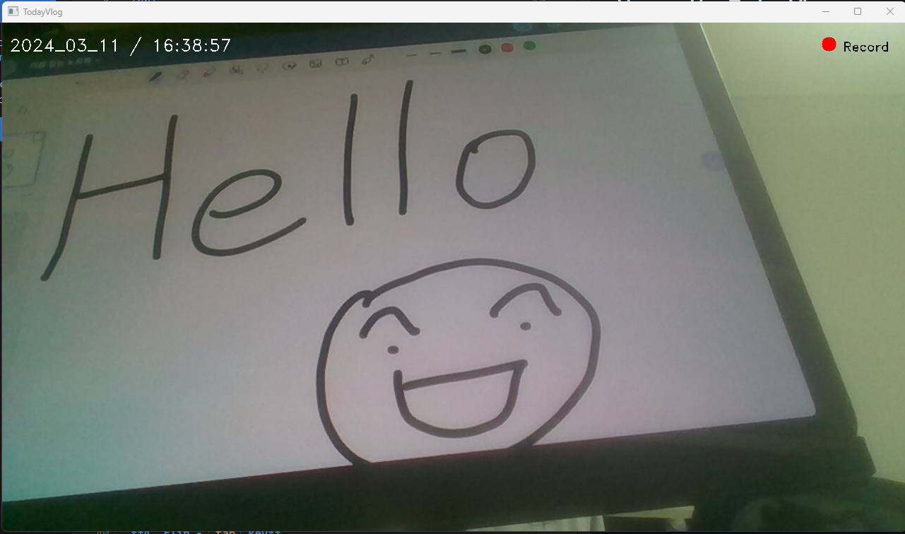
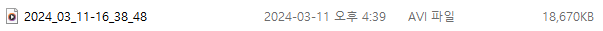
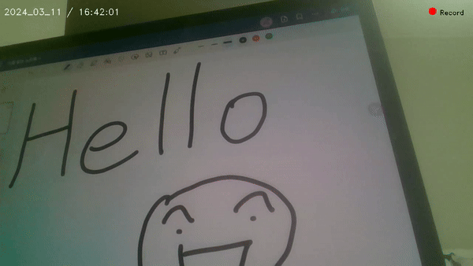
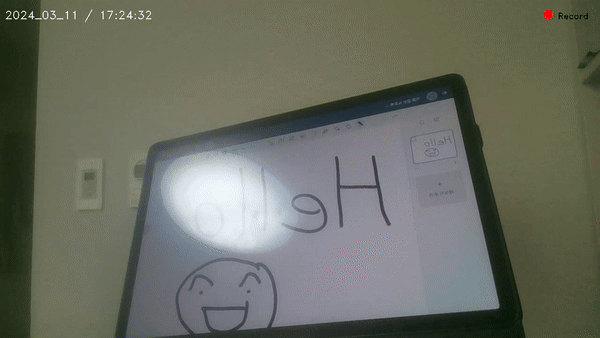

# TodayVlog

## What is TodayVlog

TodayVlog is video recorder for vlog using openCV and webCam.  
(Frame width X height = 1280 X 720)

 

## How to Use Today Vlog

**1. Change Mode - `Space` key**

- **Preivew Mode**
  

  - Control Speed

 

- **Record**
  

  - Start to Record
  - Once recording starts, you can save the video by pressing the space key
  - The current time and date

 

**2. Save your video**

  
You can get video file _named by today date-current time_

 

**3. Control Speed - `<`, `>` key**

- `<` key : speed down
- `>` key : speed up
- speed : 0.25, 0.5, 1, 1.5, 1.7

❌ **It can use only in Preview Mode**

 

**4. Flip - `Tab` key**  
Flip your screen  
It can use in _anything mode_

 

**5. Terminate - `ESC` key**

 
 

## Demo

- demo

 

- result video
  
